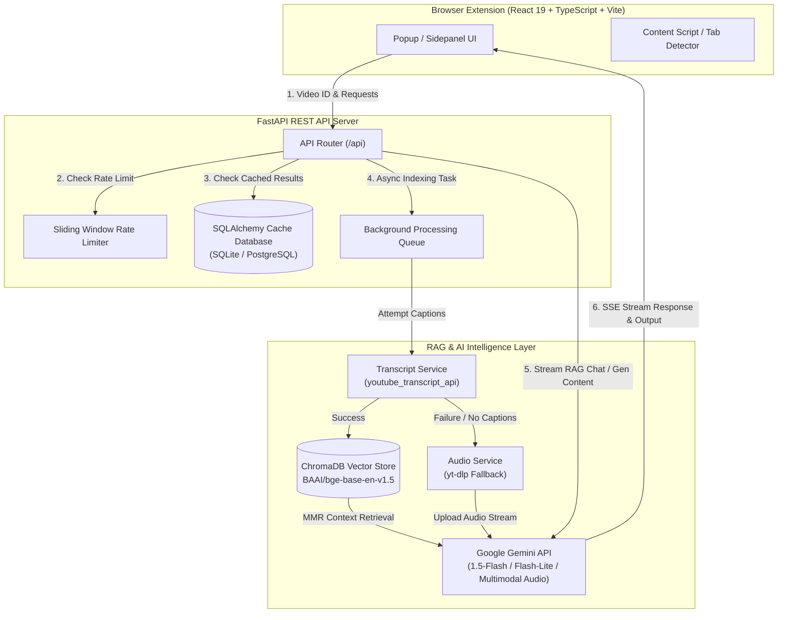

# 🌟 Lumora — AI-Powered Interactive YouTube Learning Hub

[](https://fastapi.tiangolo.com/)
[](https://react.dev/)
[](https://www.typescriptlang.org/)
[](https://tailwindcss.com/)
[](https://ai.google.dev/)
[](https://www.trychroma.com/)
[](LICENSE)

> **Lumora** is a state-of-the-art AI learning assistant built as a modern Chrome Extension. It transforms any YouTube video into an interactive learning experience with Retrieval-Augmented Generation (RAG), native audio fallback, smart notes, auto-generated quizzes, interactive timelines, and active-recall flashcards—right in your browser side panel.

---


---

## 📖 Table of Contents

- [Key Features](#-key-features)
- [System Architecture & Data Flow](#-system-architecture--data-flow)
- [Dual-Engine Processing Pipeline](#-dual-engine-processing-pipeline)
- [Tech Stack](#-tech-stack)
- [Getting Started](#-getting-started)
  - [Prerequisites](#prerequisites)
  - [Backend Setup](#1-backend-setup)
  - [Frontend Extension Setup](#2-frontend-extension-setup)
- [REST API Reference](#-rest-api-reference)
- [RAG Evaluation Framework](#-rag-evaluation-framework)
- [Production Readiness & Optimization](#-production-readiness--optimization)
- [Known Limitations](#-known-limitations)
- [License & Acknowledgments](#-license--acknowledgments)

---

## ✨ Key Features

Lumora brings a full suite of AI learning tools into YouTube's interface through a sleek, glassmorphic Chrome Extension popup/sidepanel.

| Feature | Description |
| :--- | :--- |
| **💬 RAG-Powered Q&A Chat** | Stream answers in real-time. Ask any question about the video and receive contextual answers with exact timestamp citations (e.g., `📍[MM:SS]`) to jump directly to the relevant part of the video. |
| **📝 Structured Smart Notes** | Automatically extracts structured notes categorized into `# Introduction`, `# Main Concepts`, `# Definitions`, `# Examples`, `# Key Takeaways`, and `# Interview Questions`. |
| **⚡ Multi-Format Summaries** | Choose from **Quick (3-sentence)**, **Detailed**, **Bulleted Digest**, **ELI5 (Explain Like I'm 5)**, or **Rapid Revision** summary modes depending on your study needs. |
| **🎯 Interactive 20-Question Quizzes** | Generates comprehensive JSON-driven quizzes featuring Multiple Choice (MCQ), True/False, and Fill-in-the-Blank questions with detailed answer explanations. |
| **⏱️ Interactive Video Timeline** | Extracts major topics and sequential timestamps covering the entire video duration from start to finish. |
| **🎴 Active-Recall Flashcards** | Generates Q&A flashcards highlighting core concepts to reinforce retention and speed up review sessions. |

---

## 🏗 System Architecture & Data Flow



---

## 💡 Dual-Engine Processing Pipeline

Lumora guarantees video indexability even when YouTube videos lack captions or subtitles:

1. **Primary Engine (Transcript RAG)**:
   - Fetches video transcripts using `youtube_transcript_api`.
   - Formats and chunks transcripts into ~1000 character overlapping blocks preserving exact timestamp metadata (`start` in seconds).
   - Generates 768-dimensional dense vector embeddings using `BAAI/bge-base-en-v1.5` via HuggingFace.
   - Stores vectors in **ChromaDB** with Maximal Marginal Relevance (MMR) search configured for high precision context retrieval.

2. **Fallback Engine (Native Multimodal Audio Analysis)**:
   - If transcripts are disabled or unavailable, Lumora automatically initiates a fallback task using `yt-dlp` to download the low-bitrate audio stream.
   - Uploads the audio file directly to **Google Gemini File API**.
   - Gemini natively processes the raw audio track for zero-transcript Q&A, summary, and quiz generation.

---

## 🛠 Tech Stack

### Frontend (Chrome Extension)
- **Framework:** React 19 + Vite
- **Language:** TypeScript
- **Styling:** Tailwind CSS (v4) + Glassmorphism aesthetic
- **Icons & UI Components:** Lucide React, `react-markdown`
- **Extension API:** Manifest V3 (Support for Chrome, Brave, Edge)
- **Linter:** Oxlint

### Backend (REST API)
- **Framework:** FastAPI (Python 3.10+)
- **ORMs & Database:** SQLAlchemy, Alembic (Migrations), SQLite (Development) / PostgreSQL (Production)
- **Vector Database:** ChromaDB
- **LLM Orchestration:** LangChain (`langchain-huggingface`, `langchain-chroma`, `langchain-google-genai`)
- **AI Models:**
  - **Vector Embeddings:** HuggingFace `BAAI/bge-base-en-v1.5`
  - **Generative LLM:** Google Gemini `gemini-1.5-flash` / `gemini-flash-lite-latest`
- **Audio Extraction:** `yt-dlp`

---

## 🚀 Getting Started

### Prerequisites

Ensure you have the following installed on your machine:
- **Node.js** (v18.x or later) & **npm**
- **Python** (v3.10 or later)
- **Google Gemini API Key** ([Get your API Key from Google AI Studio](https://aistudio.google.com/))
- `ffmpeg` (required for `yt-dlp` audio processing fallback)

---

### 1. Backend Setup

1. **Clone the repository:**
   ```bash
   git clone https://github.com/Anuradha05-Tech/Lumora.git
   cd Lumora/backend
   ```

2. **Create and activate a virtual environment:**
   ```bash
   python -m venv venv
   # On Linux/macOS:
   source venv/bin/activate
   # On Windows:
   # venv\Scripts\activate
   ```

3. **Install backend dependencies:**
   ```bash
   pip install -r requirements.txt
   ```
   *(Note: Ensure dependencies including `fastapi`, `uvicorn`, `langchain-google-genai`, `langchain-chroma`, `langchain-huggingface`, `yt-dlp`, `sqlalchemy`, and `alembic` are installed).*

4. **Configure Environment Variables:**
   Create a `.env` file in the `backend/` directory:
   ```env
   GEMINI_API_KEY=your_actual_gemini_api_key_here
   LLM_MODEL=gemini-1.5-flash
   DATABASE_URL=sqlite:///./lumora.db
   RATE_LIMIT_REQUESTS=10
   RATE_LIMIT_WINDOW_SEC=60
   ```

5. **Run Database Migrations (Optional):**
   ```bash
   alembic upgrade head
   ```

6. **Start the FastAPI server:**
   ```bash
   uvicorn main:app --host 0.0.0.0 --port 8000 --reload
   ```
   The backend API will be available at `http://localhost:8000`. You can explore interactive API docs at `http://localhost:8000/docs`.

---

### 2. Frontend Extension Setup

1. **Navigate to the extension directory:**
   ```bash
   cd ../extension
   ```

2. **Install frontend dependencies:**
   ```bash
   npm install
   ```

3. **Build the Chrome Extension:**
   ```bash
   npm run build
   ```
   This will generate a production-ready `dist/` directory containing all compiled scripts and assets.

4. **Load the Extension into your Browser:**
   1. Open Google Chrome (or any Chromium browser like Brave/Edge).
   2. Navigate to `chrome://extensions/`.
   3. Enable **Developer mode** (toggle in the top-right corner).
   4. Click **Load unpacked**.
   5. Select the `Lumora/extension/dist` folder.
   6. Open any YouTube video, click the Lumora extension icon, and start learning! 🚀

---

## 📡 REST API Reference

| Endpoint | Method | Description | Request Body / Parameters |
| :--- | :---: | :--- | :--- |
| `/api/process_video` | `POST` | Triggers background transcript indexing or audio processing | `{"video_id": "string", "title": "string"}` |
| `/api/status/{job_id}` | `GET` | Polls indexing status (`processing`, `done`, `failed`) | Path parameter: `job_id` |
| `/api/chat` | `POST` | Streams RAG chat responses with timestamp citations | `{"video_id": "string", "query": "string", "history": []}` |
| `/api/generate/{content_type}` | `POST` | Generates or fetches cached learning artifacts | Path: `summary`, `notes`, `quiz`, `flashcards`, `timeline`<br>Body: `{"video_id": "string", "subtype": "quick"}` |

---

## 🧪 RAG Evaluation Framework

Lumora incorporates an automated **LLM-as-a-Judge** evaluation harness to benchmark answer accuracy and factual consistency.

### How it Works
1. Evaluation ground-truth pairs are stored in `backend/eval/qa_pairs.json`.
2. Running the harness queries the live Lumora streaming `/api/chat` endpoint for each question.
3. A separate judge model (`gemini-flash-lite-latest` or `gemini-1.5-flash` with zero temperature) grades responses on a scale from **1 (Completely Wrong)** to **5 (Perfectly Accurate & Comprehensive)**.
4. Results are summarized into `backend/eval/results.json`.

### Run Benchmarks
To evaluate system performance:
```bash
cd backend
python eval/run_eval.py
```

---

## 🛡 Production Readiness & Optimization

- **Asynchronous Task Queue:** Uses FastAPI `BackgroundTasks` so long-running audio processing doesn't block client requests.
- **Result Caching:** Generative outputs (Notes, Quizzes, Flashcards, Summaries, Timelines) are serialized into the relational database (`lumora.db`), drastically reducing latency and API usage on repeat visits.
- **Sliding-Window Rate Limiting:** Enforces client-based request throttling (`X-Install-ID` or IP) to prevent API quota exhaustion.
- **Database Abstraction:** Built on SQLAlchemy ORM supporting seamless migration from SQLite to enterprise PostgreSQL with Alembic.

---

## ⚠️ Known Limitations

- **Database Concurrency:** SQLite is default for local development; high-concurrency multi-user production environments should configure PostgreSQL.
- **Audio Processing Latency:** For videos without YouTube captions, downloading the full audio track via `yt-dlp` and uploading to Gemini introduces noticeable indexing latency before interaction begins.
- **Rate Limit Reset:** Rate limiting utilizes an in-memory sliding window; restarting the FastAPI application resets active quota counters.

---

## 📄 License & Acknowledgments

Distributed under the **MIT License**. See `LICENSE` for more information.

Developed with ❤️ using Google Gemini, LangChain, FastAPI, and React.
